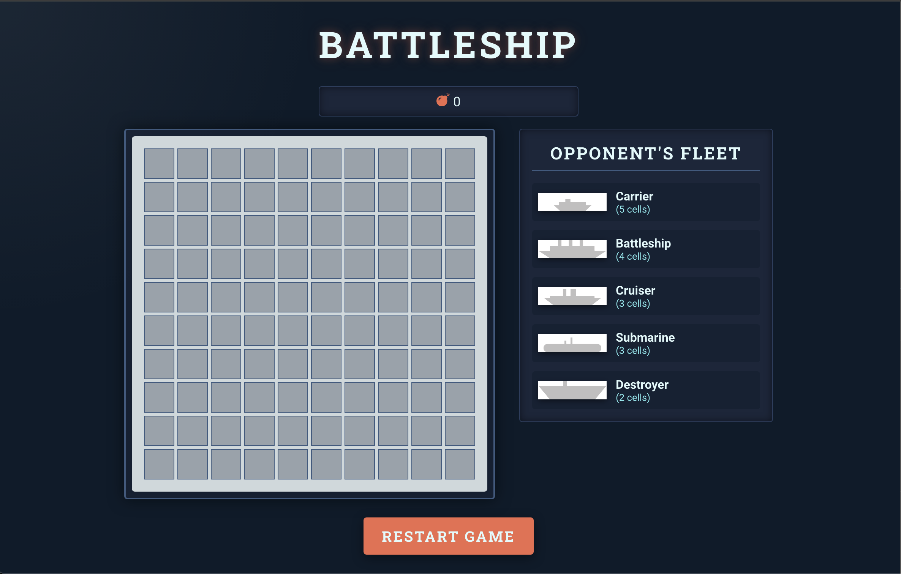
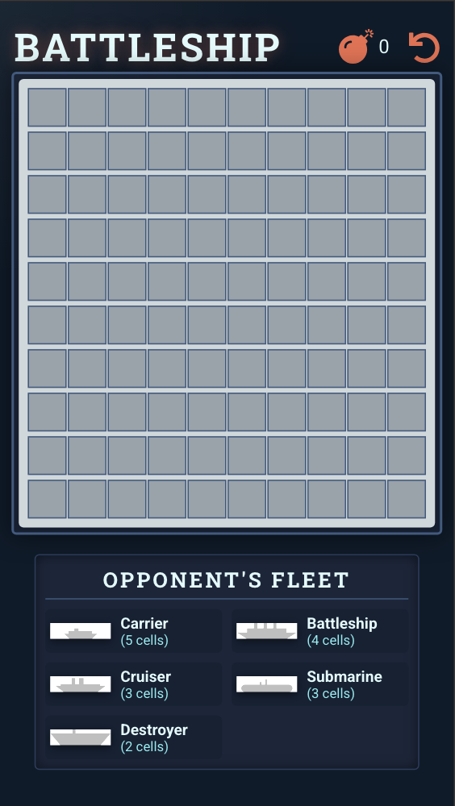

# Battleship

A modern, accessible, and fully tested implementation of the classic Battleship game in React + TypeScript.

**Note:** This implementation only covers player 1 actions (single player). There is no AI or opponent logic—your goal is to sink all ships on the board.

## 🚀 Technologies Used

- **React 19** – UI components and hooks
- **TypeScript** – Type safety throughout
- **Zustand + Immer** – Global state management with immutable updates
- **Framer Motion** – Smooth, centralized animations
- **Radix UI** – Accessible toasts and UI primitives
- **LESS** – Modular, themeable styles
- **Vite** – Lightning-fast dev/build tooling
- **Vitest + React Testing Library** – Unit and component tests
- **clsx** – Clean, conditional class names

## 🎮 Gameplay

- Play classic Battleship against a deterministic ship layout (no randomization, for testability)
- Click to fire at grid cells; hits, misses, and sunk ships are animated and visually distinct
- Game state (shots, sunk ships, game over) is managed globally and updates instantly
- Responsive design: works beautifully on desktop and mobile
- Accessible: ARIA roles, keyboard navigation, and screen reader labels

## 📱 Mobile Friendly

- The UI adapts for smaller screens, with touch-friendly controls and readable layouts

## 🧑‍💻 Development

### Scripts

- `npm run dev` – Start the Vite dev server
- `npm run build` – Build for production
- `npm run test` – Run all unit and component tests
- `npm run test:watch` – Watch mode for tests
- `npm run lint` – Lint the codebase

### Folder Structure

- `src/components/` – All React components (Board, BoardCell, ShipLegend, BoardToast, etc.)
- `src/hooks/` – Zustand store and hooks
- `src/config/` – Game and animation configs
- `src/constants/` – UI and game constants
- `src/types/` – TypeScript types
- `src/utils/` – Pure game logic helpers
- `src/__tests__/` – Unit and component tests
- `src/assets/` – Images and icons

## 🧪 Testing

- All core logic and UI components are covered by unit and integration tests using Vitest and React Testing Library
- Store and utility functions are tested for deterministic behavior
- Components are tested for rendering, interaction, and accessibility

## ♿ Accessibility

- Uses ARIA roles and labels for all interactive elements
- Keyboard navigation is supported throughout
- Toasts and feedback are screen reader friendly

## 📝 Customization

- Ship layouts and board size are easily configurable in `src/config/battleship.ts`
- Animations are centralized in `src/config/animations.ts` for easy tweaking
- Styles are modular and themeable via LESS variables

## 📦 Dependencies

- See `package.json` for a full list of dependencies and devDependencies
